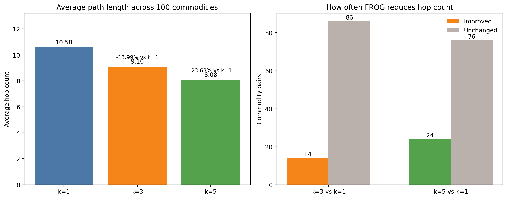
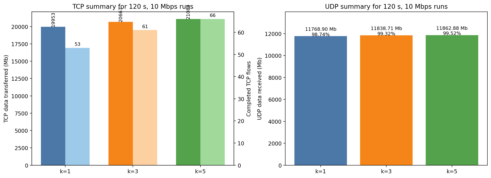

# FROG Extension: Selecting Better Ingress and Egress Satellites

Date: 2026-03-29  
Workspace: `/workspaces/SatComHypatia-frog`  
Reference papers:

- `W1_imc2020-hypatia.pdf`
- `HAL.pdf`

This report assumes the baseline Hypatia environment from `REPORT_PAPER_HYPATIA.md` is already complete. The clone, Docker build, dependency installation, and `ns3-sat-sim` build are not repeated here. This report starts from the additional work needed to run the `papier2` FROG extension and regenerate its outputs.

## 3.1 Introduction and Algorithmic Idea

The original Hypatia routing used in the `paper` workflow attaches each ground station to the nearest visible satellite. In this report that baseline is denoted as `k=1`.

The FROG extension in `papier2` changes only the ingress and egress satellite choice. The routing inside the satellite graph still follows Hypatia's forwarding-state generation and shortest-path logic. The added heuristic evaluates more than one visible candidate satellite at the source and destination:

- `k=1`: original Hypatia behavior, implemented with `algorithm_free_one_only_over_isls`
- `k=3`: FROG variant, implemented with `algorithm_free_one_only_over_isls3`
- `k=5`: FROG variant, implemented with `algorithm_free_one_only_over_isls5`

The algorithm idea described in `HAL.pdf` is:

1. inspect the `k` nearest visible satellites for the source ground station
2. inspect the `k` nearest visible satellites for the destination ground station
3. choose the ingress and egress satellites using the following priority:
   - common satellite
   - directly connected satellite pair
   - pair that yields a shorter path than the plain nearest-satellite choice

The purpose is not to redesign all of Hypatia. It is to improve the first and last satellite attachment points so the end-to-end route through the constellation becomes shorter or more stable for data transfer.

## 3.2 Implementation and Workflow

### 3.2.1 Implementation

The FROG changes are concentrated in the forwarding-state generation code and in the `papier2` experiment orchestration.

Files added:

- `satgenpy/satgen/dynamic_state/algorithm_free_one_only_over_isls3.py`
- `satgenpy/satgen/dynamic_state/algorithm_free_one_only_over_isls5.py`

These two wrappers expose the new routing algorithms to the existing dynamic-state generation pipeline.

Files modified:

- `satgenpy/satgen/dynamic_state/fstate_calculation.py`
- `satgenpy/satgen/dynamic_state/generate_dynamic_state.py`
- `papier2/satellite_networks_state/main_helper.py`
- `papier2/paper2.sh`
- `papier2/ns3_experiments/traffic_matrix_load/step_1_generate_runs2.py`
- `papier2/satgenpy_analysis/perform_full_analysis.py`
- `papier2/ns3_experiments/traffic_matrix_load/runs_results.py`
- `papier2/ns3_experiments/traffic_matrix_load/runs_logs4.py`
- `papier2/ns3_experiments/traffic_matrix_load/hop_count.py`
- `papier2/ns3_experiments/traffic_matrix_load/step_3_generate_plots.py`

Main implementation roles:

- `fstate_calculation.py`
  adds the `k=3` and `k=5` forwarding-state calculations and writes helper outputs such as `src_to_dst.txt`
- `generate_dynamic_state.py`
  registers the new algorithms so they can be called exactly like the original Hypatia algorithm
- `main_helper.py`
  extends the accepted algorithm list for the `papier2` topology-generation scripts
- `paper2.sh`
  defines the active `papier2` experiment matrix and supports `START_INDEX` and `END_INDEX` for partial reruns
- `step_1_generate_runs2.py`
  creates run directories, traffic schedules, and ns-3 configuration files for the `papier2` experiments
- `perform_full_analysis.py`
  computes theoretical path and RTT analysis for the generated routes
- `runs_results.py`
  aggregates TCP and UDP summaries from the completed run directories
- `runs_logs4.py`
  overlays per-flow TCP logs into a single visualization
- `hop_count.py`
  compares route lengths across algorithms
- `step_3_generate_plots.py`
  generates the throughput plots and now exports PNG files in addition to the PDFs

### 3.2.2 Workflow

The commands below generate only the `papier2` results. They reuse the environment already prepared for the original Hypatia report.

Step 1. Start the existing container

```bash
docker compose up -d hypatia-dev
```

Purpose:

- restart the already configured development container
- avoid rebuilding the environment

If Git commands in the container fail on the bind-mounted workspace with:

```text
error: read error while indexing .travis.yml: Resource deadlock avoided
error: read error while indexing LICENSE: Resource deadlock avoided
error: read error while indexing integration_tests/run_integration_tests.sh: Resource deadlock avoided
Bus error
```

apply the same workspace fix used earlier:

```bash
git config --local core.checkStat minimal
git config --local core.trustctime false
git config --local core.preloadIndex false
```

Step 2. Confirm the active `papier2` configuration

```bash
docker compose exec -T hypatia-dev bash -lc '
cd /workspaces/SatComHypatia-frog/papier2
sed -n "41,46p" paper2.sh
'
```

This validated run uses:

- constellation: `main_telesat_1015.py`
- simulation duration: `120 s`
- dynamic-state update interval: `10000 ms`
- ISL topology: `isls_plus_grid`
- ground stations: `ground_stations_top_100`
- throughput setting: `10 Mbps`

Step 3. Run the baseline `k=1` case

```bash
docker compose exec -T hypatia-dev bash -lc '
cd /workspaces/SatComHypatia-frog/papier2
START_INDEX=0 END_INDEX=0 bash paper2.sh
'
```

What this generates:

- dynamic routing state in `papier2/satellite_networks_state/gen_data/`
- theoretical analysis in `papier2/satgenpy_analysis/data/`
- ns-3 run outputs in `papier2/ns3_experiments/traffic_matrix_load/runs/`

Step 4. Run the FROG `k=3` case

```bash
docker compose exec -T hypatia-dev bash -lc '
cd /workspaces/SatComHypatia-frog/papier2
START_INDEX=2 END_INDEX=2 bash paper2.sh
'
```

What this generates:

- the same categories of outputs as step 3, but for `algorithm_free_one_only_over_isls3`

Step 5. Run the FROG `k=5` case

```bash
docker compose exec -T hypatia-dev bash -lc '
cd /workspaces/SatComHypatia-frog/papier2
START_INDEX=4 END_INDEX=4 bash paper2.sh
'
```

What this generates:

- the same categories of outputs as step 3, but for `algorithm_free_one_only_over_isls5`

Important bug at this stage:

If the full six-entry `paper2.sh` matrix is executed without restriction, the MCNF variants can fail with:

```text
gurobipy._exception.GurobiError: Model too large for size-limited license
```

Practical fix used in this workspace:

- run only indices `0`, `2`, and `4` for the validated `k=1`, `k=3`, and `k=5` comparison
- alternatively, install a full Gurobi license before attempting the MCNF variants

That workaround is consistent with the actual completed results available in this repository: the shortest-path family variants are complete, while the MCNF family is not.

## 3.3 Regenerate Post-Processing Outputs

After the three validated runs exist, regenerate the summary outputs from the `traffic_matrix_load` directory:

```bash
docker compose exec -T hypatia-dev bash -lc '
cd /workspaces/SatComHypatia-frog/papier2/ns3_experiments/traffic_matrix_load
python3 runs_results.py
python3 hop_count.py
python3 step_3_generate_plots.py
python3 runs_logs4.py
'
```

What each command writes:

- `python3 runs_results.py`
  - `results_tcp_10_Mbps_for_120s.txt`
  - `results_udp_10_Mbps_for_120s.txt`
- `python3 hop_count.py`
  - `hop_count.txt`
- `python3 step_3_generate_plots.py`
  - `data/traffic_goodput_total_data_sent_vs_runtime.csv`
  - `data/traffic_goodput_rate_vs_slowdown.csv`
  - `data/run_dirs.csv`
  - `pdf/plot_goodput_total_data_sent_vs_runtime.pdf`
  - `pdf/plot_goodput_total_data_sent_vs_runtime.png`
  - `pdf/plot_goodput_rate_vs_slowdown.pdf`
  - `pdf/plot_goodput_rate_vs_slowdown.png`
- `python3 runs_logs4.py`
  - `pdf/runs_logs4_tcp_overlay_120s_10mbps.pdf`
  - `pdf/runs_logs4_tcp_overlay_120s_10mbps.png`

Bug and fix for `runs_results.py`:

This script originally filtered the wrong duration tag and ignored the 120-second experiment outputs. The incorrect setting was:

```python
tps_simu = "_20"
```

The fix was to change it to:

```python
tps_simu = "_120"
```

and to make the script write the TCP summary file in addition to the UDP summary file.

Bug and fix for `hop_count.py`:

The original script crashed on empty path files from the incomplete MCNF variants:

```text
Traceback (most recent call last):
  File "/workspaces/SatComHypatia-frog/papier2/ns3_experiments/traffic_matrix_load/hop_count.py", line 64, in <module>
    tab_hopcount[i].append(read_hop_file(f_hop_count))
  File "/workspaces/SatComHypatia-frog/papier2/ns3_experiments/traffic_matrix_load/hop_count.py", line 31, in read_hop_file
    path_at_0 = file.readlines()[0].strip().split(',')
IndexError: list index out of range
```

The fix was:

- skip empty or invalid path files
- compute statistics only from valid route files
- write `N/A` for missing MCNF averages instead of crashing

Bug and fix for `step_3_generate_plots.py`:

The script originally generated only PDFs. It was modified to convert the PDFs to PNG as well. If the PDF-to-PNG conversion tool is missing, the terminal error is:

```text
pdftoppm: command not found
```

Fix:

- install Poppler inside the container
- rerun `python3 step_3_generate_plots.py`

Bug and fix for `runs_logs4.py`:

The original script was interactive and attempted to display a GUI window from the container. The fix was:

- save outputs directly to PDF and PNG
- close the figure automatically when no `DISPLAY` is available

## 3.4 Results

The validated comparison is the three-case shortest-path family:

- `k=1`: original Hypatia nearest-satellite ingress/egress
- `k=3`: FROG over the 3 nearest visible satellites
- `k=5`: FROG over the 5 nearest visible satellites

### 3.4.1 Path Length Evaluation

The file analyzed here is:

- `papier2/ns3_experiments/traffic_matrix_load/hop_count.txt`

The first lines of the file are:

- `AVERAGE DIFFERENCE SP 3: -10.57%`
- `AVERAGE DIFFERENCE SP 5: -19.05%`

These percentages are the average of the per-commodity relative differences stored in the file. They are not the same number as the ratio of the global average hop counts. Both views are useful:

- the file headline reports mean relative reduction per commodity
- the table below reports the reduction computed from the average hop counts themselves

Generated visualization:



Comparison table:

| Variant | Average hop count | Change vs `k=1` | Relative change from average hops | Commodity pairs improved | Commodity pairs unchanged | Commodity pairs worse |
| --- | ---: | ---: | ---: | ---: | ---: | ---: |
| `k=1` | 10.58 | - | - | - | - | - |
| `k=3` | 9.10 | -1.48 hops | -13.99% | 14/100 | 86/100 | 0/100 |
| `k=5` | 8.08 | -2.50 hops | -23.63% | 24/100 | 76/100 | 0/100 |

Analysis:

- `k=3` already improves the mean route length, but the effect is selective. Only 14 out of 100 commodity pairs become shorter; the other 86 stay identical.
- `k=5` improves more pairs and achieves a larger reduction. It shortens 24 out of 100 commodity pairs and leaves the rest unchanged.
- No commodity pair became worse in this dataset. That matters because it shows the heuristic is conservative: it tends either to preserve the baseline route or to improve it.
- The main gain comes from a subset of problematic baseline choices where the nearest visible satellite is not the best ingress or egress point for the final end-to-end path.
- The stronger result for `k=5` is consistent with the FROG idea: a larger candidate set gives the heuristic more chances to find a better common satellite, direct-neighbor pair, or shorter end-to-end combination.

### 3.4.2 Throughput Evaluation

The files analyzed here are:

- `papier2/ns3_experiments/traffic_matrix_load/results_tcp_10_Mbps_for_120s.txt`
- `papier2/ns3_experiments/traffic_matrix_load/results_udp_10_Mbps_for_120s.txt`

Generated visualization:



TCP comparison:

| Variant | TCP data transferred | Completed TCP flows | Completion rate | Data change vs `k=1` |
| --- | ---: | ---: | ---: | ---: |
| `k=1` | 19952.83 Mb | 53/100 | 53% | - |
| `k=3` | 20667.38 Mb | 61/100 | 61% | +3.58% |
| `k=5` | 21083.73 Mb | 66/100 | 66% | +5.67% |

UDP comparison:

| Variant | UDP data received | UDP data sent | Delivery ratio | Received-data change vs `k=1` |
| --- | ---: | ---: | ---: | ---: |
| `k=1` | 11768.90 Mb | 11919.67 Mb | 98.74% | - |
| `k=3` | 11838.71 Mb | 11919.67 Mb | 99.32% | +0.59% |
| `k=5` | 11862.88 Mb | 11919.67 Mb | 99.52% | +0.80% |

Analysis:

- TCP benefits more strongly than UDP from the FROG ingress/egress selection.
- Moving from `k=1` to `k=3` raises transferred TCP volume from `19952.83 Mb` to `20667.38 Mb` and increases completed flows from `53` to `61`.
- Moving from `k=1` to `k=5` pushes the TCP total further to `21083.73 Mb` and raises completed flows to `66`.
- The TCP completion-rate gain is substantial: `+8` percentage points for `k=3` and `+13` percentage points for `k=5` over the baseline.
- UDP also improves, but the absolute gain is smaller because UDP is already close to saturation in the baseline case. Delivery rises from `98.74%` to `99.32%` for `k=3` and to `99.52%` for `k=5`.
- This difference between TCP and UDP is expected. TCP is more sensitive to route quality, RTT variation, and loss-induced congestion-control effects. A better ingress/egress choice therefore has more visible impact on TCP than on a bulk UDP sender that already keeps sending at a fixed rate.

### 3.4.3 TCP Performance Evaluation

The figure analyzed here is:

- `papier2/ns3_experiments/traffic_matrix_load/pdf/runs_logs4_tcp_overlay_120s_10mbps.png`

Visualization:


This figure overlays one logged TCP flow and shows three time series:

- congestion window (`cwnd`)
- RTT
- transmitted progress

Important interpretation note:

- the figure was regenerated after updating `runs_logs4.py`
- the legend now matches the paper-style comparison exactly:
  - `1-nearest` for the baseline `k=1`
  - `3-nearest` for the FROG `k=3` variant
  - `5-nearest` for the FROG `k=5` variant
- the overlay is therefore directly consistent with the `k=1`/`k=3`/`k=5` comparison used throughout this report

Observed behavior in the figure:

- In the `progress` panel, the red optimized curve accumulates bytes faster than the green baseline curve for most of the run and reaches the final progress level earlier.
- The blue curve also stays ahead of the green baseline for a large part of the trace.
- In the `cwnd` panel, the optimized curve grows earlier and spends longer periods at larger congestion-window values before major resets.
- The green baseline curve shows sharper collapses, especially near the first few seconds and again around later route changes.
- In the `RTT` panel, all curves experience early spikes around the first handover period, then oscillate as topology changes occur.
- The optimized route does not simply win by always having the lowest RTT. Instead, it appears to maintain more favorable transport dynamics overall: faster early window growth, fewer severely disruptive events, and faster cumulative byte delivery.

Interpretation:

- This figure supports the aggregated TCP results from the summary file.
- The benefit of FROG is not only a shorter geometric path in some cases; it also improves how the TCP flow experiences route changes over time.
- Better ingress and egress selection can reduce the number of harmful path choices that trigger stronger congestion-window collapse or slower recovery.
- That is why the transport-level gain is larger than the pure UDP gain and why the completed-flow count improves significantly from `k=1` to `k=3` and `k=5`.
