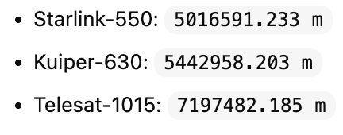

# ISL Topology Report

Date: 2026-03-26
Branch: `applyDAD`

## 1) Purpose

This note explains the inter-satellite link (ISL) structure used in this project, with emphasis on:

- what `isls_plus_grid` means,
- what `isl_shift=0` means,
- whether satellite indices change during the simulation,
- whether the ISL topology stays fixed or changes over time,
- the difference between intra-orbit and inter-orbit ISLs,
- how this applies to the example route `Paris -> Kabul`.

## 2) Terminology

- `ISL`: inter-satellite link, meaning a link between two different satellites.
- `GSL`: ground-to-satellite link, meaning a link between a ground station and a satellite.
- `intra-orbit ISL`: an ISL between two satellites in the same orbital plane.
- `inter-orbit ISL`: an ISL between two satellites in neighboring orbital planes.

Important clarification:

- This project does not use "intra-satellite links" as routing links.
- The correct term is `intra-orbit ISL`, not `intra-satellite link`.

## 3) How `isls_plus_grid` Is Built

The topology is generated in:

- `satgenpy/satgen/isls/generate_plus_grid_isls.py`

For each satellite identified by:

- orbit index `i`
- position index `j` inside the orbit

the code creates two undirected links:

1. a link to the next satellite in the same orbit
2. a link to one satellite in the adjacent orbit

The key logic is:

```python
sat_same_orbit = i * n_sats_per_orbit + ((j + 1) % n_sats_per_orbit)
sat_adjacent_orbit = ((i + 1) % n_orbits) * n_sats_per_orbit + ((j + isl_shift) % n_sats_per_orbit)
```

Meaning:

- `sat_same_orbit`: same orbit, next satellite index
- `sat_adjacent_orbit`: next orbit, shifted position index

Because the graph is undirected, every satellite also receives links from:

- the previous satellite in the same orbit
- the corresponding satellite in the previous orbit

So each satellite has total degree `4` in the plus-grid topology:

- `2` intra-orbit ISLs
- `2` inter-orbit ISLs

## 4) What `isl_shift=0` Means

In this repository, the Telesat-1015 setup uses:

```python
isl_shift=0
```

This means:

- a satellite at position `j` in orbit `i`
- connects across to position `j` in orbit `i+1`

So the cross-orbit links are aligned by index, with no position offset.

Examples:

- `isl_shift=0`: connect `(i, j)` to `(i+1, j)`
- `isl_shift=1`: connect `(i, j)` to `(i+1, j+1)`
- `isl_shift=2`: connect `(i, j)` to `(i+1, j+2)`

Thus, `isl_shift=0` means the cross-orbit ISL pattern is index-aligned.

## 5) Does the Satellite Index Change During the Simulation?

No. The satellite index stays fixed for the whole simulation.

What remains fixed:

- satellite IDs,
- the contents of `isls.txt`,
- the plus-grid neighbor pattern.

What changes:

- the physical 3D positions of the satellites,
- the physical distance of each ISL,
- the resulting routing edge weights.

So the correct interpretation is:

- the ISL topology is fixed,
- the ISL geometry is dynamic.

## 6) Does the Grid Stay the Same During the Simulation?

Topologically: yes.

Geometrically: no.

That means:

- satellite `106` is always linked to the same four neighbor satellites in the plus-grid design,
- but the actual distance of those links changes over time as the satellites move.

This happens because the simulation recomputes satellite positions at every timestep and then recomputes the ISL edge weights from those current positions.

Therefore:

- the adjacency pattern stays the same,
- the physical link lengths do not stay the same.

## 7) What Happens If Two Neighboring-Orbit Satellites Move In Different Directions?

Yes, two satellites in adjacent orbits can move such that their mutual distance changes over time.

For a fixed ISL pair:

- the distance may increase,
- the distance may decrease,
- the distance is generally time-varying rather than constant.

In this codebase, the ISL pair is still kept as a defined link, but the current distance is recomputed at each timestep.

If the distance ever exceeds the allowed maximum ISL range, the code raises an error rather than silently removing that link.
generate_dynamic_state.py (line 164)

       sat_distance_m = distance_m_between_satellites(satellites[a], satellites[b], str(epoch), str(time))
        if sat_distance_m > max_isl_length_m:
            raise ValueError(
                "The distance between two satellites (%d and %d) "
                "with an ISL exceeded the maximum ISL length (%.2fm > %.2fm at t=%dns)"
                % (a, b, sat_distance_m, max_isl_length_m, time_since_epoch_ns)
            )





So the project assumes:

- fixed designed ISL pairs,
- dynamic link lengths,
- and feasibility is enforced by a maximum-range check.

## 8) Example: Paris -> Kabul

For the example:

- `Paris` ground-station ID: `24`
- `Kabul` ground-station ID: `80`

Forwarding-state node IDs:

- `Paris`: `351 + 24 = 375`
- `Kabul`: `351 + 80 = 431`

At `t = 0s`, the baseline path is:

```text
375 -> 106 -> 119 -> 132 -> 145 -> 158 -> 171 -> 170 -> 431
```

Interpretation:

- `375 -> 106`: GSL from Paris to satellite 106
- `106 -> 119 -> 132 -> 145 -> 158 -> 171 -> 170`: ISL segment
- `170 -> 431`: GSL from satellite 170 to Kabul

Within the ISL segment:

- every hop is an inter-satellite link,
- not an intra-satellite link.

These ISL hops can be classified as plus-grid links:

- some are intra-orbit ISLs,
- some are inter-orbit ISLs,
- depending on whether the two satellite IDs belong to the same orbital plane or adjacent orbital planes.

## 9) Example of One Real DA-FW ISL Edge

For the first ISL hop in that path:

- `106 -> 119`

the direction-aware algorithm uses:

- `p_i`: current 3D position of satellite 106
- `p_j`: current 3D position of satellite 119
- `v_i`: displacement vector of satellite 106 over a 1-second sampling interval
- `link = p_j - p_i`
- `w0 = ||link||`
- `alpha = cos(v_i, link)`
- `w = w0 * (1 - beta * alpha)`

For `t = 0s`, the measured values were:

```text
p_i = [4300954.099, -453777.852, 5988537.555]
p_j = [2848029.111, -114940.535, 6813318.394]
v_i = [-5963.120, -1672.265, 4142.849]
link = [-1452924.988, 338837.317, 824780.839]
w0 = 1704718.505 m
alpha = 0.906495
```

This gives:

```text
beta = 0.0 -> w = 1704718.505
beta = 0.1 -> w = 1550186.607
beta = 0.2 -> w = 1395654.709
beta = 0.3 -> w = 1241122.811
```

Interpretation:

- `alpha > 0` means the satellite velocity is strongly aligned with the directed link direction,
- so increasing `beta` reduces the effective DA-FW cost on this directed edge.

## 10) Why the Route Comparison Is Not Based On One Path Alone

Even though `Paris -> Kabul` at `t = 0s` is a useful example, the final algorithm comparison is not computed from a single path.

The report metrics are computed over:

- all commodity pairs,
- all timesteps,
- all reconstructed forwarding-state paths.

For the `20s` / `100ms` run:

- `200` timesteps were evaluated,
- `100` source-destination pairs were sampled,
- so each algorithm was evaluated over `20,000` path samples.

This is why:

- one pair at one timestep may look identical across all algorithms,
- while the overall averages can still differ significantly.

## 11) Final Summary

- Satellite IDs remain fixed during the simulation.
- The plus-grid ISL topology remains fixed during the simulation.
- The geometric distance of each fixed ISL changes over time.
- `isl_shift=0` means cross-orbit links connect satellites with the same position index in adjacent orbits.
- Each satellite has `4` ISL neighbors in this topology:
  - `2` intra-orbit ISLs
  - `2` inter-orbit ISLs
- There is no routing concept here called `intra-satellite link`.
- In the `Paris -> Kabul` example, the middle chain `106 -> 119 -> 132 -> 145 -> 158 -> 171 -> 170` is entirely an ISL chain between satellites.
