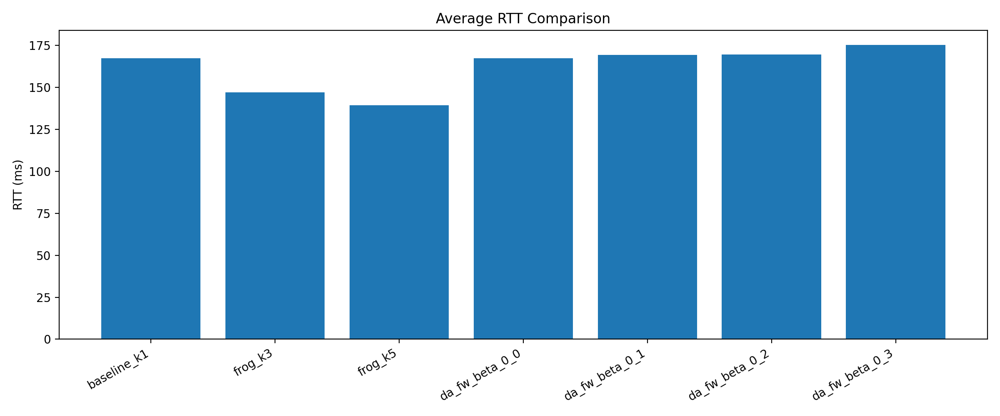
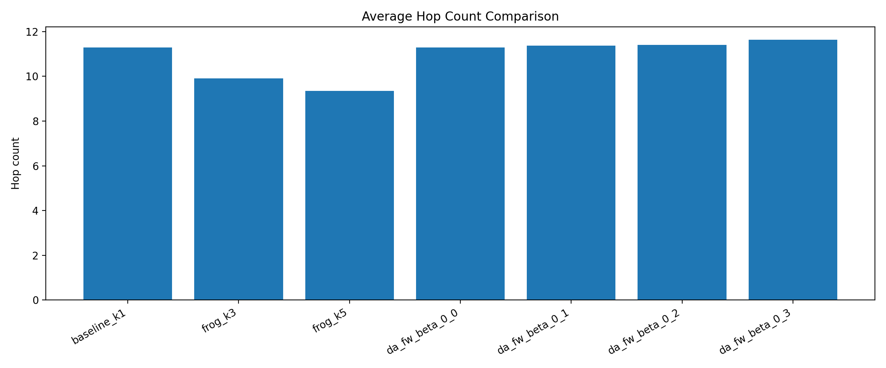
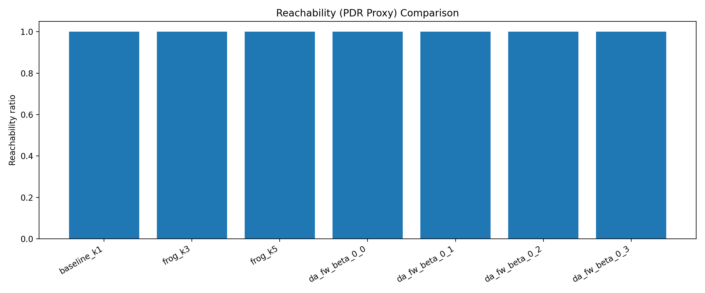
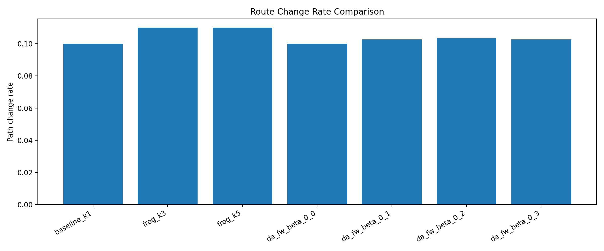

# Papier3 Run Report (Direction-Aware Floyd–Warshall)

Date: 2026-03-28  
Branch used: `applyDAD`

## 1) What Was Implemented

- Added a new dynamic-state routing algorithm:
  - `algorithm_direction_aware_floyd_warshall`
  - Direction-aware ISL cost for directed link `i -> j`:
    - `alpha = cos(velocity(i), link_direction(i->j))`
    - `w = w0 * (1 - beta * alpha)` (default `f(alpha)=-alpha`)
- Added directed all-pairs shortest-path computation via Floyd–Warshall for the new mode.
- Kept baseline (`k=1`) and existing FROG (`k=3`, `k=5`) logic unchanged.
- Added reproducible `papier3/` experiment scripts:
  - smoke verification (`k=1`, `k=3`, `k=5`, DA-FW)
  - full 7-variant comparison run
  - summary table generation
  - confidence interval table generation
  - plot generation

## 2) Files Changed

- `satgenpy/satgen/dynamic_state/algorithm_direction_aware_floyd_warshall.py` (new)
  - New DA-FW algorithm implementation
- `satgenpy/satgen/dynamic_state/generate_dynamic_state.py`
  - Registered DA-FW mode
  - Added beta parsing from algorithm name suffix
- `papier2/satellite_networks_state/main_helper.py`
  - Accepted `algorithm_direction_aware_floyd_warshall*` in one-interface GSL branch
- `papier3/config/experiment_config.json` (new)
  - Reproducible experiment matrix config
- `papier3/scripts/run_experiments.py` (new)
  - End-to-end smoke + generation + analysis + plotting orchestrator
- `papier3/scripts/compute_summary.py` (new)
  - Metric extraction and summary table generation
- `papier3/scripts/compute_confidence_intervals.py` (new)
  - 95% CI computation for task-4.2 metrics from raw sampled routes
- `papier3/scripts/plot_results.py` (new)
  - Comparison and DA-beta plots
- `papier3/scripts/run_all.sh` (new)
  - Single-command wrapper
- `papier3/README.md`

## 3) Commands To Reproduce

From repo root:

1. Dependency required in this environment:
```bash
python3 -m pip install --user gurobipy
```

2. Run smoke checks + full experiment matrix + tables + plots:
```bash
python3 papier3/scripts/run_experiments.py --config papier3/config/experiment_config.json
```

3. Optional rerun analysis/plots only (no regeneration):
```bash
python3 papier3/scripts/run_experiments.py --config papier3/config/experiment_config.json --skip-generation --skip-smoke
```

4. Compute task-4.2 confidence intervals from raw samples:
```bash
python3 papier3/scripts/compute_confidence_intervals.py --config papier3/config/experiment_config.json
```

5. Optional force full regeneration (ignore cached dynamic-state directories):
```bash
python3 papier3/scripts/run_experiments.py --config papier3/config/experiment_config.json --force-regenerate
```

## 4) Dependencies / Setup Notes

- Python 3
- Python packages used by this run:
  - `numpy`, `networkx`, `astropy`, `ephem`, `matplotlib`, `gurobipy`
- Existing generated topology/data under:
  - `papier2/satellite_networks_state/gen_data/`
- Commodity list source:
  - `papier2/satellite_networks_state/commodites.temp`

## 5) Bugs Encountered And Fixes

1. `satgen` import failed due missing `gurobipy`.
   - Fix applied in environment: `python3 -m pip install --user gurobipy`
2. FROG debug side-effect files were touched during smoke run (`src_to_dst.txt`, `possibilities_5.txt`).
   - Fix applied: restored tracked file and removed generated temporary file.
3. Matplotlib / font cache warnings still appear in this environment.
   - Practical handling: summary and CI generation succeeded cleanly; plot image files were refreshed successfully, but the plotting wrapper process still emitted cache-related warnings.

## 6) Outputs Regenerated

Main outputs:

- Summary tables:
  - `papier3/results/summary_metrics.csv`
  - `papier3/results/summary_metrics.md`
  - `papier3/results/summary_metrics.json`
  - `papier3/results/summary_metrics_ci.csv`
  - `papier3/results/summary_metrics_ci.json`
- Plot files:
  - `papier3/results/plots/*.png`
  - `papier3/results/plots/*.pdf`

Dynamic-state basis for this report:

- Full (`120s`, `10s`) dynamic-state directories were used for all 7 algorithms:
  - baseline `k=1`
  - FROG `k=3`
  - FROG `k=5`
  - DA-FW `beta=0.0`
  - DA-FW `beta=0.1`
  - DA-FW `beta=0.2`
  - DA-FW `beta=0.3`

Plot regeneration:

- Summary and CI tables were regenerated successfully for the `120s` / `10s` setting.
- Plot files under `papier3/results/plots/` were refreshed for the same setting.
- Matplotlib / font cache warnings still occur in this environment, but the output image files were updated.

## 7) Cached / Temp Reuse

- Existing `120s` / `10s` dynamic-state directories under `papier2/satellite_networks_state/gen_data/` were reused.
- The summary tables, confidence intervals, and plot files in `papier3/results/` were regenerated from those `120s` / `10s` forwarding-state outputs.

## 8) Result Interpretation (120s Simulation, 10s Timestep)

Data sources:

- `papier3/results/summary_metrics.csv`
- `papier3/results/summary_metrics_ci.csv`

### 8.1) Experimental Methodology: Scenarios Actually Covered In This Run

This practical run matches the task requirements in the following way:

- Different values of the directional bias parameter `beta` were evaluated with DA-FW at `0.0`, `0.1`, `0.2`, and `0.3`.
- Multiple source-destination pairs were evaluated through the existing commodity list in `papier2/satellite_networks_state/commodites.temp`.
- The run produced `12` timesteps per algorithm (`120s` at `10s`) and `1,200` route samples per algorithm.
- Communication was ground-to-ground via the satellite network.
- The practical run used one constellation/orbital configuration already present in the repository: `telesat_1015`, `isls_plus_grid`, `ground_stations_top_100`.
- Statistical confidence is reported from the observed samples using 95% confidence intervals.

Practical limitation of this run:

- This report does not include a sweep over multiple constellation sizes or orbital parameters.
- It therefore satisfies the comparison across routing algorithms and `beta` values, but not a multi-constellation sensitivity study.

### 8.2) Performance Metrics: Averages And 95% Confidence Intervals

| Algorithm | End-to-end latency (ms) | Packet delivery ratio | Average hop count | Path stability (route-change rate) |
|---|---:|---:|---:|---:|
| baseline_k1 | 167.325 [162.945, 171.705] | 1.0000 [0.9968, 1.0000] | 11.282 [10.991, 11.572] | 0.100000 [0.083640, 0.119144] |
| frog_k3 | 147.077 [142.657, 151.498] | 1.0000 [0.9968, 1.0000] | 9.907 [9.619, 10.194] | 0.110000 [0.092849, 0.129865] |
| frog_k5 | 139.359 [134.847, 143.871] | 1.0000 [0.9968, 1.0000] | 9.355 [9.063, 9.647] | 0.110000 [0.092849, 0.129865] |
| da_fw_beta_0_0 | 167.325 [162.945, 171.705] | 1.0000 [0.9968, 1.0000] | 11.282 [10.991, 11.572] | 0.100000 [0.083640, 0.119144] |
| da_fw_beta_0_1 | 169.487 [164.970, 174.003] | 1.0000 [0.9968, 1.0000] | 11.365 [11.070, 11.660] | 0.102727 [0.086146, 0.122073] |
| da_fw_beta_0_2 | 169.732 [165.197, 174.267] | 1.0000 [0.9968, 1.0000] | 11.398 [11.100, 11.695] | 0.103636 [0.086983, 0.123049] |
| da_fw_beta_0_3 | 175.353 [170.435, 180.271] | 1.0000 [0.9968, 1.0000] | 11.633 [11.320, 11.945] | 0.102727 [0.086146, 0.122073] |

Illustrative plots generated from this `120s` / `10s` run:









### 8.2.1) Worked Example A: Xiamen -> Rio-de-Janeiro

This is the farthest city pair in the current `120s` / `10s` run where baseline and DA-FW choose different paths.

- Source / destination:
  - `Xiamen -> Rio-de-Janeiro`
  - ground distance: `18,123.6 km`
  - node IDs: `437 -> 369`
- Destination satellite selected by the existing forwarding pipeline at `t=0s`:
  - destination satellite `64`
  - GS-to-satellite distance `1,173,731.25 m`

Paths at `t=0s`:

- baseline `k=1`
```text
437 -> 44 -> 43 -> 42 -> 55 -> 54 -> 53 -> 52 -> 64 -> 369
```

- FROG `k=3`
```text
437 -> 44 -> 43 -> 42 -> 55 -> 54 -> 53 -> 52 -> 64 -> 369
```

- FROG `k=5`
```text
437 -> 44 -> 43 -> 42 -> 55 -> 54 -> 53 -> 52 -> 64 -> 369
```

- DA-FW `beta=0.3`
```text
437 -> 44 -> 45 -> 46 -> 47 -> 48 -> 61 -> 62 -> 63 -> 64 -> 369
```

The first divergence is at satellite `44`:

- baseline chooses `44 -> 43`
- DA-FW chooses `44 -> 45`

State at satellite `44` at `t=0s`:

```text
p_44 = (-3745724.546, 5409622.094, 3366178.962)
v_44 = (-415.612, 3710.248, -6413.859)
||v_44|| = 7421.338
```

Baseline candidate `44 -> 43` using the original normalized-direction formula:

```text
p_43 = (-2935947.790, 3175587.691, 5988536.465)
p_43 - p_44 = (809776.755, -2234034.403, 2622357.503)
||p_43 - p_44|| = 3538842.605

d_44,43 = (p_43 - p_44) / ||p_43 - p_44||
        = (0.228825, -0.631290, 0.741021)

alpha_44,43 = (v_44 · d_44,43) / (||v_44|| * ||d_44,43||)
            = -0.968848

w0(44,43) = 3541201.699 m
w_DA(44,43) = w0 * (1 - 0.3 * alpha)
            = 4570467.591
```

DA-FW candidate `44 -> 45`:

```text
p_45 = (-3699104.157, 6403262.466, -14522.770)
p_45 - p_44 = (46620.389, 993640.372, -3380701.731)
||p_45 - p_44|| = 3524008.917

d_44,45 = (p_45 - p_44) / ||p_45 - p_44||
        = (0.013229, 0.281963, -0.959334)

alpha_44,45 = (v_44 · d_44,45) / (||v_44|| * ||d_44,45||)
            = 0.969325

w0(44,45) = 3540717.490 m
w_DA(44,45) = w0 * (1 - 0.3 * alpha)
            = 2511085.780
```

Why the next hop flips:

- baseline compares `w0(44,n) + remaining_baseline(n -> 64)`
  - via `43`: `23,281,490.458`
  - via `45`: `26,830,751.217`
  - baseline therefore picks `44 -> 43`
- DA-FW compares `w_DA(44,n) + remaining_DA(n -> 64)`
  - via `43`: `27,296,788.668`
  - via `45`: `20,215,881.590`
  - DA-FW therefore picks `44 -> 45`

The reason is direct:

- `44 -> 43` is strongly anti-aligned with motion: `alpha = -0.968848`
- `44 -> 45` is strongly aligned with motion: `alpha = 0.969325`

So DA-FW heavily penalizes `44 -> 43` and strongly discounts `44 -> 45`.

End-to-end RTT comparison at `t=0s`:

- baseline / FROG `k=3` / FROG `k=5`
```text
path length = 25,744,339.833 m
one-way     = 85.874 ms
RTT         = 171.748 ms
```

- DA-FW `beta=0.3`
```text
path length = 29,293,602.795 m
one-way     = 97.713 ms
RTT         = 195.426 ms
```

Interpretation:

- For this far-city case, baseline and both FROG variants choose the same path at `t=0s`.
- DA-FW changes the route because the direction-aware edge reweighting strongly prefers `44 -> 45` over `44 -> 43`.
- That DA-FW route is physically longer, so the actual RTT increases from `171.748 ms` to `195.426 ms`.

### 8.2.2) Worked Example B: Buenos-Aires -> São-Paulo

This is a near-city case where FROG clearly outperforms baseline, while DA-FW does not improve on baseline.

- Source / destination:
  - `Buenos-Aires -> São-Paulo`
  - ground distance: `1,678.2 km`
  - node IDs: `363 -> 354`
- Baseline / DA-FW destination satellite selected by the existing forwarding pipeline at `t=0s`:
  - destination satellite `64`
  - GS-to-satellite distance for São-Paulo `1,240,187.5 m`
- FROG's short path at `t=0s` uses satellite `228` as the relay satellite:
  - Buenos-Aires to satellite `228`: `1,325,675.0 m`
  - São-Paulo to satellite `228`: `1,669,419.0 m`

Paths at `t=0s`:

- baseline `k=1`
```text
363 -> 228 -> 229 -> 230 -> 217 -> 204 -> 191 -> 178 -> 165 -> 152 -> 139 -> 126 -> 113 -> 100 -> 87 -> 74 -> 61 -> 62 -> 63 -> 64 -> 354
```

- FROG `k=3`
```text
363 -> 228 -> 354
```

- FROG `k=5`
```text
363 -> 228 -> 354
```

- DA-FW `beta=0.3`
```text
363 -> 228 -> 229 -> 230 -> 217 -> 204 -> 191 -> 178 -> 165 -> 152 -> 139 -> 126 -> 113 -> 100 -> 87 -> 74 -> 61 -> 62 -> 63 -> 64 -> 354
```

End-to-end RTT comparison at `t=0s`:

- baseline / DA-FW `beta=0.3`
```text
path length = 43,576,111.316 m
one-way     = 145.354 ms
RTT         = 290.709 ms
hops        = 20
```

- FROG `k=3` / `k=5`
```text
path length = 2,995,094.000 m
one-way     = 9.991 ms
RTT         = 19.981 ms
hops        = 2
```

Observed behavior across the full `120s` / `10s` run:

- baseline and `DA-FW beta=0.3` are identical at all `12 / 12` sampled timesteps for this pair
- `FROG k=3` and `FROG k=5` differ from baseline at all `12 / 12` sampled timesteps

Interpretation:

- This near-city case does not give DA-FW any advantage because the direction-aware reweighting does not alter the baseline route at all.
- FROG is much better because it is not locked to the same single candidate routing structure used by baseline and DA-FW for this pair.
- Instead, FROG uses satellite `228` as a direct relay visible to both ground stations, collapsing a `20`-hop baseline path into a `2`-hop route.
- The result is a dramatic RTT reduction from `290.709 ms` to `19.981 ms`.

### 8.3) Expected Outcomes: Interpretation Of Observed Trends

1. Identify scenarios where direction-aware routing outperforms standard Dijkstra:
- In this practical `120s` / `10s` Telesat-1015 scenario, no DA-FW setting with `beta > 0` outperformed baseline `k=1`.
- `da_fw_beta_0_0` matched baseline exactly, which is the expected equivalence check.
- The observed DA-FW trend in this scenario is therefore "correct but not beneficial" rather than "better than baseline".

2. Analyze sensitivity to the parameter `beta`:
- The DA-FW results worsen monotonically as `beta` increases.
- RTT rises from `167.325 ms` at baseline / `beta=0.0` to `169.487 ms` at `beta=0.1`, `169.732 ms` at `beta=0.2`, and `175.353 ms` at `beta=0.3`.
- Hop count follows the same direction, from `11.282` to `11.365`, `11.398`, and `11.633`.
- This indicates that the directional penalty is strong enough in this scenario to steer routes onto physically longer paths without compensating benefit.

3. Discuss trade-offs between latency reduction and path stability:
- DA-FW does not provide a favorable latency-stability trade-off here.
- `beta=0.1` and `beta=0.3` both produce route-change rates just above the baseline while still increasing latency and hop count.
- `beta=0.2` is slightly worse than baseline on both latency and route-change rate as well.
- In short, the DA-FW variants do not buy stability improvements in exchange for latency loss in this run.

4. When and why mobility-aware routing outperforms standard Dijkstra:
- In this practical run, the clear mobility-aware gains come from the existing FROG family, not from DA-FW.
- `frog_k3` reduces RTT from `167.325 ms` to `147.077 ms` and hop count from `11.282` to `9.907`, but route-change rate rises from `0.100000` to `0.110000`.
- `frog_k5` further reduces RTT to `139.359 ms` and hop count to `9.355`, with the same `0.110000` route-change rate.
- The observed reason is that FROG's multi-candidate routing explores more path alternatives and finds shorter routes through the evolving topology, whereas the DA-FW directional edge reweighting does not translate into better end-to-end path choices in this scenario.

5. Scenarios where FROG routing performs better:
- In this exact `120s` / `10s` top-100-ground-station scenario, both FROG variants outperform baseline and all DA-FW variants on latency and hop count.
- `frog_k3` remains the more conservative FROG setting, while `frog_k5` gives the best pure RTT and hop-count result.
- Both FROG variants pay for those gains with slightly higher route churn than baseline.

6. Trade-offs between latency optimization and route stability:
- `frog_k3` gives a favorable latency-vs-complexity trade-off, but not a stability improvement: route-change rate rises from `0.100000` to `0.110000`.
- `frog_k5` gives the strongest latency optimization, and in this `120s` / `10s` run its route-change rate is also `0.110000`.
- DA-FW does not show a useful trade-off here because increasing `beta` degrades latency and hop count without producing a compensating reduction in route changes.

### 8.4) Main Conclusion For This Practical Run

- The baseline equivalence check passed: `da_fw_beta_0_0` reproduced baseline `k=1` exactly in all reported metrics.
- In this scenario, DA-FW with positive `beta` values did not outperform baseline `k=1`.
- The key reason is that DA-FW minimizes the modified internal routing cost `w = w0 * (1 - beta * alpha)`, not the true physical propagation distance used to compute RTT.
- As the Xiamen -> Rio-de-Janeiro example shows, DA-FW can assign a better internal weight to a motion-aligned edge and therefore choose it, but that edge can still lead into a physically longer end-to-end route.
- When that happens, the DA-FW shortest path in the modified graph is no longer the lowest-RTT path in the real satellite geometry, so RTT gets worse even though the chosen DA-FW path has the better optimization weight.
- The strongest improvements came from the existing FROG methods, especially `frog_k5` for minimum latency and `frog_k3` for the lighter multi-path variant.
- The Buenos-Aires -> São-Paulo example shows why FROG can be much better than baseline in a near-city case: FROG can exploit a direct relay satellite visible to both endpoints, while baseline and DA-FW stay on a long ISL chain inherited from the baseline forwarding workflow.
- The practical conclusion is that predictable mobility can clearly be exploited in this repository, but in this tested scenario the benefit is captured by FROG rather than by the current DA-FW heuristic.
